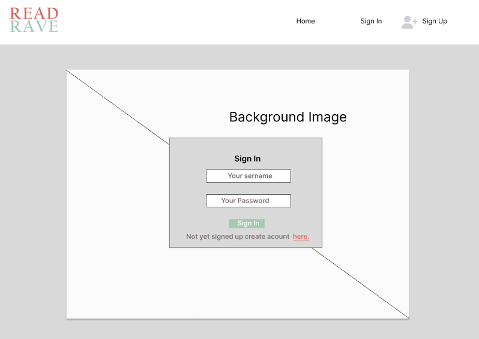
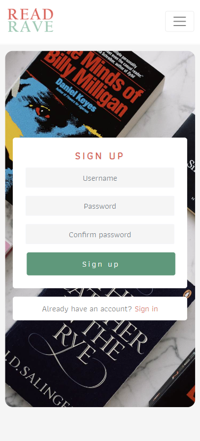
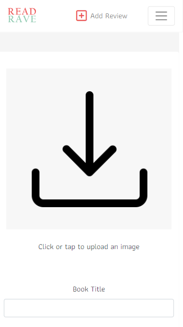

<h1><strong>Project 5 - ReadRave a Book Review Application </strong></h1>
 
*Advanced frontend project*  

[View the live site here](https://read-rave-86b7234dccae.herokuapp.com/)
                                

## About
ReadRave is a online platform and a community for readers that allows you to review books and follow other readers for recommendations.

This application was made using primarly [React]() and [Django Rest Framework](). Django Rest Framework was used to build a backend API and frontend was build using React framework that consumes Django Rest Framework data. Both the backend and frontend are combined under one repository in this case. You can find the React Application inside the *fronend* folder of this repository.

For further information feel free to keep reading or if you want to view the ready project click [here](https://read-rave-86b7234dccae.herokuapp.com/).

## Project Goals

- Build an online platform allowing users to share their interst on books.
- Allows users to post reviews, read reviews and follow readers alike.
- All visitors to the page should be able to view reviews.
- Registered users should be able to share a review with a photo, review content and review score.
- Registered users should be able to like and comment on reviews.
- Application should be responsive on different screen sizes.
- Application should provide a simple intuitive interface that is easy to navigate.
- Sites layout and colorscheme is pleasing and keeps users coming back to it.

### Problem Statement
Every project needs a problem statement and for this project the following statement was generated:

- "I am **a user** trying to **find an application where I can share, read and follow content about the books I like** but **I can't find one** because **other applications aren't specific enough** which makes me feel **like I can't share my passion for books with anyone**."

### Frontend Developer Role 
This project was made with an intent to demonstrate advanced frontend skills and few pricipals were followed in order to simulate the essential and important role that frontend developers play in a larger team:
- Craft an user interfaces (UI) and optimize user experiences (UX). 
- Design and implement visually appealing interface, ensuring compatibility across different browsers and devices.
- Integrate Front-End to the Back-End systems. 
- Stay aware of the user needs and optimize performance for faster loading times. 
- Goal should to deliver engaging and user-friendly web applications.

## UX/UI - Design
### Wireframes
- Wireframes were made with Figma.
- Wireframes were made to have quidelines for styling the pages, but not set rules for final product. 
- Released project was broadly similar to the drafted wireframes.
- Most notable changes to the wireframes was the review cards layout. 

Home Page

  
  

  *Wireframe for the home page on desktop and mobile*

Sign In and Sign Up page

  
  
  

  *Wireframe for the Sign In page on desktop and mobile.*

  *Wireframe for the Sign Up page on desktop and mobile.*

Review Page

  
  
  

  *Wireframe for the Review page on desktop and mobile.*

Profile Page

  
  
  

  *Wireframe for the Review page on desktop and mobile.*

Creat/Edit/Delete Form

  
  
  

  *Wireframe for the Review page on desktop and mobile.*

### Color Scheme
Following color were selected for the project:
- Charcoal : Text, borders and details
- Mint Green : Logo, Highlights
- Coral Red : Logo, Highlights
- White : Background and models
- Smoke White/Grey : Background

## Data Design - Backend/Django Rest Framework
A design for data was drafted using [diagrams.net](https://app.diagrams.net/).

The data diagram has 5 models user, profile, review, comment and like.

View the digram

 

## Agile Stragety
Agile methodologies were applied in the development process of this project. Following principles were kept in mind during he process:
- Development process maintained flexible, so changes could be implemented if it yielded better results.
- Features where kept to minimum, avoiding useless features.
- Features were implemented in order of priority.
- Project was developed in small iterations in order ensure functionality of each feature implemented.
- Github Project board was used as an information radiator to manage feature implementation.
- User Stories were used to design user centric features

## User Stories
User Stories were made using the Github _Issues_ feature. Each issue equated a User Story. Each Issue was tagged with a lable, a Github Issues feature, based on it's importance for the application. Following labels were created (listed in order of importance): 
- Must have
- Should have
- Could have
- Nice to have

Issues were added on the Github Projects Boards, a builtin management tool from GitHub, as tasks. The implementation of the features was tracked by moving the tasks on each of the boards column. Three columns were named: Todo, InProgress and Done.

All together **number** user stories were drafted and Acceptance Criteria together with Tasks were created. View all user stories on the repository issues or on the project board [@P5 Book Review App Kanban](https://github.com/users/HMuraja/projects/5/views/1).

### Backend User Stories
Following **9** user stories were implemented during the development of the backedn API. Please see the [project issues](https://github.com/HMuraja/p5-book-review/issues) for the relevant userstories with the **BackEnd tag**.

Backend User Stories Table

| Title                     | Story                                                                                                                                        | Priority               | Implemented |
| ------------------------- | -------------------------------------------------------------------------------------------------------------------------------------------- | ------------------- | ----------- |
| Profile Model | As a **user/viewer** As a **user** I can **view, edit and delete my profile** so that **I can personalize my account and view my data** | Must Have | Yes |
| Review Model | As a **user** I can **create, edit and delete review** so that **I can share a review on books l have read** | Must Have | Yes          |
| Comment Model | As a **user** I can **easily create a comment and edit/delete it if i want to** so that **I discuss of any reviews I am interested of**.| Must Have | Yes  |
| View Comment Instance | As a **viewer** I can **easily see comments other have made to the review** so that **I can see what other people though about the review**| Should Have | Yes          |
| Like Model | As a **user** I can **boost the reviews I think are good** so that **I can have an impact on the quality of the reviews posted**| Should Have | Yes          |
| Like Feed | As a **user** I can **view the reviews I liked** so that **I can find easily any reviews that I liked** | Should Have | Yes          |
| Follow Model | As a **user** I can **follow users that I like** so that **I modify my personal feed to include reviews from users I like** | Could Have | Yes          |
| Authentication - Backend | As a **user** I can **easily login and logout** so that **I can access the content and be recognized as a logged in user by the application**.| Could Have | Yes          |
| Profile Summary - Backend | As a **user/viewer** I can **view anyone's profile details** so that **I can see a summary of their interactions and activity**. | Could Have | Yes          |

### Frontend User Stories
Following **11** user stories were implemented during the development of the fronend interface. Please see the [project issues](https://github.com/HMuraja/p5-book-review/issues) for the relevant userstories with the **frontend tag**.

Frontend User Stories Table

| Title                     | Story                                                                                                                                        | Priority               | Implemented |
| ------------------------- | -------------------------------------------------------------------------------------------------------------------------------------------- | ------------------- | ----------- |
| Navigation| As a **user** I can **view a navbar from every page** so that **I can navigate easily between pages**. | Must Have | Yes |
| Authentication | As a **user** I can **easily login and logout** so that **I can access the content and be recognized as a logged in user by the application**. | Must Have | Yes          |
| Routing | As a **user** I can **navigate through pages quickly** so that **I can view content seamlessly without page refresh**.| Must Have | Yes  |
| Create Review | As a **user** I can **easily make a review or edit a review** so that **I can share my thought on my read books**. | must Have | Yes          |
| User Profile View | As a **user** I can **view other user profiles** so that **I can find and follow like minded users**.| Could Have | Yes          |
| Edit Profile | As a **user** I can **view, edit or delete my profile** so that **I have full control over how I am displayed on this website** | Should Have | Yes          |
| View Comment | As a **a user** I can **read comments** so that **I can see what is the reception for the review**. | Should Have | Yes          |
| Leave a Comment | As a **logged in user** I can **leave and edit comments** so that **I can share my point of view on the reviews.**.  | Should Have | Yes          |
| Following | As a **logged in user** I can **follow other users** so that **I can receive personalized reviews and encourage the followed user to stay active**. | Could Have | Yes          |
| Like Review | As a **logged in user** I can **like a review ** so that **I can encourage reviews I deem good or/and share my opinion on the posted review**. | Should Have | Yes          |
| Read Review | As a **user** I can **easily access the reviews made by others** so that **I can read content made by other users**. | Must Have | Yes          |

## Features

### Header/Navigation Menu
App icon and the navigation items are placed on the top of the application. The navigation menu items are links to home, feed, profile and signup pages. Navigatio options available for the viewer are login, signup and home. Icon works as a link to home page. 
 
On Medium sized screens and smaller the menu collapses into a dropdown menu.

*Navigation menu desktop.*

*Navigation menu mobile view.*

*Navigation menu's drop down menu on mobile view.*

### Sign In

If the user has already signed up and are logged out from their account they can press *Sign In* button on the navigation menu and a sign in form will render.

User needs to enter username and their password and click sign in. The form will be validated and an error message will display if the sign in isn't succesful.

On succesfull login user will be led to the home page, and navigation mneu will be updated dsiplaying the profile of the logged in user.

*Sign in page for desktop and mobile*

*Sign in error.*

### Signup

If the user wants more customized experience of the applicatiopn or want's to share content they must sign up. User opens up the sign up form, by clicking the sign up link/button on the navigation menu or the link on the sign in form. 

Sign up form requires user to choose a username and password. Password needs to be entered twice. If passwords entered don't match or the passowrd is too simple an error message will display. 

Succsesfull sign up will lead the user to the sign in page. 

*Sign up page for desktop and mobile screen*

*Sign up form, too common password, no mach error.*

### Sign Out

Once logged in, a sign out button is visible on the navigation menu on the top. Clickign the button will return the user to the home page.

### Home Menu/Review List
The home page or the landing displays all the shared review cards. All reviews are displayed one after each other and 10 most recent reviews are downloaded at a time.Scrolls down will dowload more reviews. 

Each review card displays an image of the reviewer, image of the book or a placeholder image, book title, book author, caption for the review and the number of stars given. On the bottom corner there is also a number of likes and comments each review has. 

On the right hand side(desktop) or on the top of post(mobile) most popular profiles are displayed.

On the top of the posts you have a search bar enabling you to search reviews based on the title, book genre or author.

*Homepage on desktop and mobile view.*
### Search Functionality
On the home page on top of all the reviews there is a search field. User can type here any search words and results will rerurn reviews that have a match on the title, author, category or reviews author name. 

*Searchfield for reviews*

If no results are found an error message and image will be displayed. 

*Error image and message.*

### Liked and Feed Pages 
Application also offers two additional listing options for the user. 

First on is called *Feed*. If the user is signed in they can accsess the feed from navigation menu, by clciking "Feed". This page will list only the reviews from the profiles user follows. If no profiles are followed no reviews are shown.

The other option is *Liked*, which can be accessed similarly through navigation menu, if user is signed in. Liked page list all the reviews user has liked. No reviews are shown again if user hasn't liked any reviews.

### Review Page
If the user clicks on the book image, they are lead on to the review's page where user can read the review and view comments. 

*Navigation menu's drop down menu on mobile view.*

### Comment

USer scan leave comment to the reviews, and they can be seen on the reviewpage. All the comments left to the review are listed from most recent to the oldes under the review content.

If the user isnät signed in, they can only see the comments left to the review. For users signed in a review fomr is visible. Review form has only one text field and a submit button. 

Succesful submission will update the comments list and add the newly created comment on the top of the list. Also the comments icon on the review card will update by increasign one number. 

If the user wishes to edit their comment, they can click on the three dots on the corner of the comment. Clicking the three dots will open a selection from which the user can either choose to edit the comment or delete it. 

Chooign edit will the edit form with the text field and submit button. Clciking submit will update the comment. Choosing delete will delete the comment and the comment icon on the review card will reduce by one. 

*Comments section under the review.*

*Comment form.*

*Comment icon and counter.*

### Like
If the user wants to like a review they have to sign in and navigate to the review they like. On the review card they must click on the heart icon, in order to like it or unlike it. The page will refresh and the number of likes will be updated and the heart icon will change depending on if the user liked (solid colored heart icon) or unliked (outlined icon). 

An error message will display if a signed in user attempts to like their own review. 

*Like button before, after and error message if attempting to like own review.*

### Add Review

If user wants to create a recipe they must click on the button at the navigation menu or the navigation link stating *Add Review*.

Clicking the link or the button should open the page with the "Add a Review"-form. All the fields, title, author, caption, content and score, are mandatory. If the user won't select an image it will be replaced with a placeholder image. Cathegory is seleceted from a list opened by dropdown menu. 

Form will be validated before being sent to the database. If data is not completed correctly an error message will display under the respective fields.

A succesful submission will take the user to the review page.

*Create review button.*

*Create review form on desktop and on mobile screen.*

*Dropdown menu and a completed review form*

*Error messages for create form*

 

*Review page of the newly created review.*

### Edit and Delete Review
Only a signed in user that is the owner of the review can edit or delete the review. User have to navigate to the review page and on the top corner there are three dots that act as an edit button. Clicking the icon will open a menu wth two icons delete and edit review.

  *Review edit button and menu*

Edit review will open a edit form for the review. Edit form is identical to the create form, apart from being prepopulated with the review data. Once user is ready clcikgin submit will validate the fields ensuring the all data is filled correctly before sending the data to database. Any errors will be flagged unser the respective field. 

If user wishes to delete the review they just need to clcik on the delete icon on the edit menu. 

### Popular Profiles

A panel for popular profiles is displayed on the right hand side, on desktop, and on the top below the navigation menu on mobile view. This panel displays the most followed profiles at that time. Clciking on any of these profiles will lead to the profile page. 

If user is signed in, on desktop view, there is a follow button right next to the profile, but on mobile view user needs to clcik to view the profile in order to access the follow button.

*Popular profiles views.*

### Follow

When signed in user can follow and unfollow other profiles by simply clciking on the follow button either next to the profile on popular profiles(visible only on larger screens) or the button on the profile page. 

THe follow button is light blue/grey when not followed and green once followed. Clicking again on followed button, will lead user unfollowing the profile. 

*Profile that isn't followed and profile that is being followed*

### Profile Page
Clciking on any of the profiles on the popular profiles or my profile on the navigation menu will lead user to the profile page. Profile page sumarises profile information on the top stating the name, displaying the image, number of reviews, follows and followers, in addition all users can add a small description to the profile. 

On the bottom of the profile details are all the reviews the profile user has created. 

*Profile page on desktop and mobile.*

If user is signed in and on their own profile page a three dot button is visible on the upper corner. This allows user to edit the profile. Clicking the edit  button will allow user to open three different editing forms: edit profile, chnange username and chnage password. 

*Edit profile options*

## Reuse of components
ReadRave, just like other React applications, is built of of components. Each component represents a part of the UI. It is a common practice to reuse components in React application as this makes the application maintenace and build easier and more flexible. 

Reuse means that the same component is used to render UI features for the application in multiple places. This reduces the need to repeat a similar code and therefore make the code more consise and readable.

Below are few examples of the reusable components. 

### Avatar.js

Avatar.js-component renders the user image and name. It is required in multiple places:
- In **Review.js**, it is used to render the image and name of the review author on top of each review card. 
- In **Profile.js** avatar is used to render the image and name for a user.
- In **NavBar.js** avatar is used to render the logged in users name and image. 

It accepts 4 props, image source, that renders the image for the avatar, a text that renders the text following the image, height for the image and a navBar parameter. All 4 properties define how Avatar componenent is defined in the given situation. 

### Asset.js
An asset componenet was used to render spinners, message images or message text. Asset.js was used in:
- **ReviewsPage** before content has been loaded and when more content is being loaded.
- **ReviewPage** before comments are loaded. 
- **PopularProfiles** before profiles are loaded.

Asset componenet can take 3 props: spinner, src and message. More props are defined more complex asset instance is built.

### Comment.js
Comment.js renders a comment instance details in user friendly form, detailing, comment author, comment, comment date and comment author image. The comment details just need to be given as props for the component once it is called. This way comments can be displayed in easy and readable form anywhere in the app, for exmple in **ReviewPage.js** each comment for the review are rendered by calling the comment component inside the map method. 

### Profile.js
Profile component renders user id and image as a link to profile page, as well as a follow and unfollow buttons. Previously mentioned Asset.js is used to build this componenet, which is a great example how components can be nested inside eachother. Profile.js component is reused on **PopularProfiles.js** component to render a list of most popular profiles.

### Review.js
Review  component is used to render the review isntance for the UI. It renders the book image, book name, author name, review author and their profile, date of creation, caption and book genre. The component is reused in **Reviews.js** to render a list of all the reviews published, each review is an instance of the Review.js component. Review.js is a good example of how the same component instances can have completely different content, yet similar "layout". Review.js takes the review instances as the prop, providing the dirrence between each component instance. 

### ReviewsPage.js
As previously mentioned review component is reused inside the ReviewsPage.js component, but the ReviewsPage.js component is reused inside the App.js component. App.js the **root component** of the application and an "entry point" for all the other components. On this component ReviewsPage.js is used to render:
- Homepage that renders all the reviews.
- Feedpage that renders reviews from the authors the user follows.
- Likedpage that renders the reviews user liked. 

The contnent on the ReviewsPage.js is determined by the "filter" props value, as it is used as the part of *axiosReq.get* command when fetching the review data. This way the reviews used on the ReviewsPage-component instance to generate instances of Review-component can be customized as needed. 

## Languages Used
**HTML5** - Used on templates to build the structure of the sites and render an iterface.   
**CSS3** - Used to add design to the html structure for more pleasing interface.  
**Python** - Used as the backend language.   
**JavaScript** - Used as the frontend language.

## Backend Frameworks and Libraries
Versions for all the libraries can be seen in the requirements.txt.
- **asgiref**: ASGI stands for Asynchronous Server Gateway Interface, which is a standard for Python asynchronous web servers and applications.
- **cloudinary**: A cloud-based image and video storage service with features like uploading, optimization, and delivery.
- **dj-database-url**: A utility for Django projects to utilize database configuration via URLs.
- **dj-rest-auth**: Provides authentication features for Django REST framework.
- Django: A high-level Python web framework that encourages rapid development and clean, pragmatic design.
- **django-allauth**: Authentication app for Django that handles various authentication methods.
- **django-cloudinary-storage**: A storage backend for Django to use Cloudinary for file storage.
- django-cors-headers: A Django application for handling the server headers required for Cross-Origin Resource Sharing (CORS).
- **django-filter**: A Django application for allowing users to filter queryset dynamically.
- **djangorestframework**: A powerful and flexible toolkit for building Web APIs in Django.
- djangorestframework-simplejwt: Provides a JSON Web Token authentication backend for Django REST framework.
- **gunicorn**: A Python WSGI HTTP server for deploying web applications.
- **oauthlib**: A generic, spec-compliant, thorough implementation of the OAuth request-signing logic.
- **Pillow**: A Python Imaging Library (PIL) fork for opening, manipulating, and saving image files.
- **psycopg2**: PostgreSQL adapter for Python.
- **PyJWT**: JSON Web Token implementation in Python.
- **python3-openid**: A set of Python packages to support use of the OpenID decentralized identity system.
- **pytz**: World timezone definitions, modern and historical.
- **requests-oauthlib**: OAuthlib support for Python requests.
- **sqlparse**: A non-validating SQL parser module for Python.
- **urllib3**: A powerful HTTP client for Python, which provides a simple interface for making HTTP requests.
- **whitenoise**: Radically simplified static file serving for Python web apps.

## Frontend Dependencies
See the version for the depencies inside the **package.json**, that can be found inside the frontend folder of this repository.

- **react-router-dom**: Enables navigation between different parts of a React app without refreshing the page (client-side routing).
- **react-dom**: Provides methods for rendering React components into the browser's DOM.
- **axios**: A promise-based HTTP client for making requests to APIs and fetching data.
- **jwt-decode**: Decodes JSON Web Tokens (JWTs) for authentication purposes.
- **react-infinite-scroll-component**: Allows easy implementation of infinite scrolling, dynamically loading content as the user scrolls down a page.

## Software and Web Applications Used
Following applications were used to make this project:

- **App Diagrams** - An application used to create database diagrams to visualize the data structure.
- **Cloudinary** - A cloud-based storage for static files, used to store project images.
- **Coolors** -  Used to generate image of the color scheme.
- **ElephantSQL** - A PostgreSQL database hosting service used to store data in this process.
- **FontAwesome** - Used to generate icons for the project.
- **GitHub** - An online repository and version control. Also used as the project management tool.
- **GitPod** - An online code editor used during this process.
- **Google Chrome Dev Tools** - A tool provided by Chrome browser, used to troubleshoot and test responsiveness of the application.
- **Google Fonts** - A free online library of fonts. Used for applying suitable fonts for the project.
- **Heroku** - A cloud platform that is used to deploy the applications.
- **Figma** - Used for creating the site wireframes.

# Testing
Final product was manually tested against the user storie's acceptance criteria. 

- **Backend** was tested against the *Backend*-tagged user stories.
- **Frontend** application was tested against the *Frontend*-tagged user stories. 

See the criterias and testing results below for each *Backend* and *Frontend* below.

In addition, responsivity and code was tested manually. 

### Backend User Stories - Tests

The final product was tested to confirm all acceptance criteria on the user stories, labelled as Backend found from [issues](https://github.com/HMuraja/p5-book-review/issues) was fulfilled. Below is the summary of all the user stories and the acceptance criteria. All criterias were fullfilled.

USER STORY: Authentication

As a **user** I can **easily login and logout** so that **I can access the content and be recognized as a logged in user by the application**.

- *Acceptance Criteria*
    - [x] **Acceptance Criteria 1:** An instance of user and profile model class are created when user signs up.
    - [x] **Acceptance Criteria 1:** Users id is automatically added to any of the instances they create.
    - [x] **Acceptance Criteria 1:** Users can't create instances without being logged in. 
- **How the Criteria was tested**:
    - User can login using the login button on the Django Rest Framework (DRF) interface. 
    - User id is used in review, follow, like and comment instances they create, to identify the creator and they can't create instaces without being logged in.  

USER STORY: Profile Model

As a **user** I can **view, edit and delete my profile** so that **I can personalize my account and view my data**

- *Acceptance Criteria*
    - [x] **Acceptance Criteria 1:** A profile is automatically created and saved after user is created.
    - [x]  **Acceptance Criteria 2:** A placeholder image is added initially when profile is created.
    - [x] **Acceptance Criteria 3:** Profiles can be sorted based onn filters and order parameters. 
    - [x] **Acceptance Criteria 4:** Profile has a description field that the user can add.
    - [x] **Acceptance Criteria 5:** User can edit username, password and profile image to their profile.
- **How the Criteria was tested**:
    - In */profiles* url all profile instances are listed.
    - If user signs up a profile instance is automatically created. 
    - A placeholder image is added to to the profile instance once created.
    - User can edit the username, password and swicth the profile photo if logged in as the owner of the profile.
    - User can add a personalized description text for their profile.
    - Profile instances can be filtered according all profiles followed by selected profile and profiles that are follow the selected profile.
    - Profile instances can be listed in order based on review counts, follower counts, following counts most recently followed profiles and most recently following profiles.

USER STORY: Profile Summary 

As a **user/viewer** I can **view anyone's profile details** so that **I can see a summary of their interactions and activity**.

- *Acceptance Criteria*
    - [x] **Acceptance Criteria 1:** List all reviews for the specified user profile. 
    - [x] **Acceptance Criteria 2:** List all the followed ids for the specified user profile.
    - [x] **Acceptance Criteria 3:** List all the follower ids for the specified user profile.
- **How the Criteria was tested**:
    - In */reviews/* results could be filtered according to the user profile that has to be the same as the review's *owner*
    - In */profiles/* all the profiles followed can be listed for the selected profile using the filters on the DRF UI. 
    - In */profiles/* all the profiles followers can be listed for the selected profile using the filters on the DRF UI. 

USER STORY: View Comment Instances

As a **viewer** I can **easily see comments other have made to the review** so that **I can see what other people though about the review**.

- *Acceptance Criteria*
    - [x] **Acceptance Criteria 1:** List all comment instances.
    - [x] **Acceptance Criteria 2:** Filter comment instances based on the review.
- **How the Criteria was tested**:
    - Extension */comments/* was added to the root url. 
    - It was confirmed that all comment instances were visible. 
    - The filtering functionality was tested by selecting a review book title name from the filters rendered by the DRF UI. 
    - The filtering worked as expected and displayed only the instances for the review selected. 

USER STORY: API and Frontend Communication

As a **user** I can **easily access data saved on the application** so that **I can interact with others and the application seamlessly.**

- *Acceptance Criteria*
    - [x] **Acceptance Criteria 1:** Build an API that generates JSON data for the front end to consume.
    - [x]  **Acceptance Criteria 2:** Front end is able to send data to the API to consume. 
    - [x] **Acceptance Criteria 3:** Application features behave smoothly and easy to understand manner.
- **How the Criteria was tested**:
    - Once API was deployed, it was confimed that the all extension for the API worked and was formatted in legible JSON format. 
    - Once Frontend was connected it was confimred it was possible to send send data to API and it was able to store it. New review, comment, profile, like and follow instances all appeared into the database and could be viewed in the JSON files. 
    - The ReadRave was tested as whole  and all features behaved smoothly being able to send, create, edit and delete data where applicable as expected. 

USER STORY: Like Feed

As a **user** I can **view the reviews I liked** so that **I can find easily any reviews that I liked**.

- *Acceptance Criteria*
    - [x] **Acceptance Criteria 1:** All like instances are listed.
    - [x]  **Acceptance Criteria 2:** Like instance list can be filtered according to the owner of the instance.
- **How the Criteria was tested**:
    - With the extension */likes* added to the root url, all like instances were listed.
    - The filters are available, and offer option for filtering the likes based on the likes owner value.
    - When filter is selected only the like instances with the selected owner value are displayed. 

USER STORY: Like Model

As a **user** I can **boost the reviews I think are good** so that **I can have an impact on the quality of the reviews posted**

- *Acceptance Criteria*
    - [x] **Acceptance Criteria 1:** Logged in user can create and delete an like instance
    - [x] **Acceptance Criteria 2:** Creating an instance automatically adds the liked review id to the like field.
- **How the Criteria was tested**:
    - The create form is available only when user is logged.
    - Delete button is available and works for the instances in */likes/[like_id]* url for the logged in users. 
    - Logged in user can create an instance by choosing the liked review id from the list. 
    - The created instance appears on the "/liked" url list.

USER STORY: Follow Model

As a **user** I can **follow users that I like** so that **I modify my personal feed to include reviews from users I like**

- *Acceptance Criteria*
    - [x] **Acceptance Criteria 1:** Followed field and following fields of the instance should be unique pairs in order to avoid duplicate follows from one person.
    - [x]  **Acceptance Criteria 2:** Users can easily create follow instance and delete it.
    - [x] **Acceptance Criteria 3:** User id is automatically added to the following field in creation.
- **How the Criteria was tested**:
    - In */followers/* url all follow instances are listed.
    - Create and delete functionalities are available only to the users logged in. 
    - Logged in user can create through form and delete follow instance when navigating to the instace they have authored (/followers/[follow_id]/).
    - A new instance is automatically added to the listed instances of follows and the user ID is automatically added to the instance, not requiring the user to specify it.
    - User can't follow twice and receives a 404 message "possible duplicate" when trying to do so.

USER STORY: Review Model

As a **user** I can **create, edit and delete review** so that **I can share a review on books l have read**

- *Acceptance Criteria*
    - [x] **Acceptance Criteria 1:** User can create and delete a review.
    - [x]  **Acceptance Criteria 2:** User can edit the title, caption, content and image.

- **How the Criteria was tested**:
    - In */reviews/* url all follow instances are listed.
    - Create and delete functionalities are available only to the users logged in.
    - User can edit title, caption, content and image if they are logged in and the owner of the review in */reviews/[review id]/* url.
    - Editing form or delete button is not available for users not logged in not owner for the review.

USER STORY: Comment Model

As a **user** I can **easily create a comment and edit/delete it if i want to ** so that **I discuss of any reviews I am interested of**

- *Acceptance Criteria*
    - [x] **Acceptance Criteria 1:** User can add a comment to a review they like.
    - [x] **Acceptance Criteria 2:** Review id is added automatically to the comment instance.
    - [x] **Acceptance Criteria 3:** User can edit or delete an comment instance they made.

- **How the Criteria was tested**:
    - In */comments/* url logged in users can leave a comment. 
    - Reviews id is automatically added to the instance.
    - In */comment/[comment id]/* url editing form and delete button are available for the user if they are the owner of the instance. 
    - Editing and deleting functionalities work.

### Frontend User Stories - Test
The final product was tested to confirm all acceptance criteria on the user stories, labelled as frontend found from [issues](https://github.com/HMuraja/p5-book-review/issues) was fulfilled. Below is the summary of all the user stories and the acceptance criteria. All criterias were fullfilled.

USER STORY: Following 

As a **logged in user** I can **follow other users** so that **I can receive personalized reviews and encourage the followed user to stay active**.

- *Acceptance Criteria*::
    - [x] **Acceptance Criteria 1:** An easy button is accessible for users to follow and unfollow. 
    - [x]  **Acceptance Criteria 2:** Users have an overview of followed profiles in their own profile. 
    - [x] **Acceptance Criteria 3:** Users personal feed has reviews only from the followed users.
- **How the Criteria was tested**:
    - A button is next to profiles listed on the most popular profiles and on the profile page.
    - Button appearance is consistently similar across the app. 
    - On users own profile, they can see a summary of the total profiles followed.
    - Logged in users can see on the their feed only prosts from the users they have followed.
    - Clicking the follow button will changed it's appearance and change into "followed" text, clearly indicating of succesful action. 
    - Clicking the button again will simply unfollow and the profile and change the appearance of the button back to "follow" text and color. 

USER STORY: Navigation

As a **user** I can **view a navbar from every page** so that **I can navigate easily between pages**.

- *Acceptance Criteria:*
    - [x] **Acceptance Criteria 1:** The navbar is visible on each page and all icons are clear and reable.
    - [x] **Acceptance Criteria 2:** The navbar collapses on mobile view.
    - [x] **Acceptance Criteria 3:** Home, log in and sign up links are the only visible  links for users that are **not** logged in.
    - [x] **Acceptance Criteria 4:** Home, log out, add review, my profile and liked links are visible  only for the logged in users.

- **How the Criteria was tested**:
    - Navigation bar is fixed to the top of the application and visible at all times.
    - From the width of 767 px and down navigation items appart from create review and logo collaps inside a menu icon. Clicking the menu items and outside of menu successfully close the menu.
    - If the user is not logged only menu items avaialable are home, sign in and sign up. 
    - When user is logged in the menu items change into add review, home, feed, liked, sign out and user profile.
    - All links work and lead to the features and function intended.     
    

USER STORY: Authentication 

    
As a **user** I can **easily login and logout** so that **I can access the content and be recognized as a logged in user by the application**.

- *Acceptance Criteria*::
    - [x] **Acceptance Criteria 1:** Users are required to log in before accessing any of the CRUD functionalities, apart from signing up.
    - [x] **Acceptance Criteria 2:** Logged in user can access all the features of the application once logged in.
    - [x] **Acceptance Criteria 3:** User who hasn't logged in can't access urls that they aren't authorized to and are redirected to the home page.
- **How the Criteria was tested**:
    - Users that aren't logged in could only view profiles and reviews, they were also able to sign up and sign in.
    - Signed in users can access all the CRUD functionalities as long as the data they want to modify is created by them.
    - If users that were not logged in attemted to access a functionality that requires authentication, like creating a new review they are redirected back to the home page. 

USER STORY: Routing 

As a **user** I can **navigate through pages quickly** so that **I can view content seamlessly without page refresh**.

- *Acceptance Criteria*:
    - [x] **Acceptance Criteria 1: When any link on the pages is clicked only the relevant components will refresh.

- **How the Criteria was tested**:
    - When any link is clicked on the application they will lead to the intended component being rendered. 
  

USER STORY: Create Reviews

As a **user** I can **easily make a review or edit a review** so that **I can share my thought on books I have read**.

- *Acceptance Criteria*::
    - [x] **Acceptance Criteria 1:** Function for creating reviews is accessible everywhere for the logged in user.
    - [x]  **Acceptance Criteria 2:** Creating review is easy and simple process. 
    - [x] **Acceptance Criteria 3:** Only the owner of the review can edit or delete the review.
- **How the Criteria was tested**:
    - The create reviews link is only visible only for the users that are logged in. 
    - Only the users logged in can access the create review form. 
    - Create review form is easy to fill and each field is clearly labelled.
    - Not filling the form correctly will provide an error messages and prevent user from creating a new instance. 
    - Error messages describe clearly what user needs to fix in order to submit the review successfully. 
    - When the owner of the review logged in they were able to click the revie wthey created and a more button is visible for them on the review page, they are able to click on it get a menu with two icons, one for editing and one for deleting. 
    - Clciking edit rendered an edit review prociding similar form than creation for allowing user to edit the details successfully.
    - Deletion deleted the review successfully. 

USER STORY: User Profile View

As a **user** I can **view other user profiles** so that **I can find and follow like minded users**.

- *Acceptance Criteria*::
    - [x] **Acceptance Criteria 1:** User profiles are accessible for all users. 
    - [x]  **Acceptance Criteria 2:** User profiles summarize the profile offer meaningful data of the selected user.

- **How the Criteria was tested**:
    - Profile pages were accessible for everyone regardless if they were signed in or not. 
    - Clikcing the profile either on the review card, popular profiles list or if logged in on the my profile link on the main menu took the user to the profile page.
    - Profile page summarized profile information into easy to read UI, displaying the profile image, name, reviews number, followed profile number and follower profile number.
    - All the numbers updated successfully if the data changed. 
    - If profile is viewed by another user and they are logged in a follow button is available. 
    - On the profile page all the reviews made by the user are displayed as a list. 

USER STORY: Edit profile Should Have

As a **user** I can **view, edit or delete my profile** so that **I have full control over how I am displayed on this website**

- *Acceptance Criteria*::
    - [x] **Acceptance Criteria 1:** My profile is easy for the user to access. 
    - [x]  **Acceptance Criteria 2:** Editing the profile is easy and straight forward
    - [x] **Acceptance Criteria 3:** User can personalize the profile to reflect them.
    - [x]  **Acceptance Criteria 3:** Profile displays clear summary of the user details.
- **How the Criteria was tested**:
    - Once user was logged the naviagtion menu shows the profile name and picture for the logged in user. 
    - Clicking onto this lead the user to their profile page and a clear edit logo is visible on the corner of the profile page. 
    - Clicking on the logo opened successfully optin sfor editing: edit, change username, change password.
    - Editing rendered an easy to read form with the possibility to update the profile name and image. Editing the the details successfully update the profile data. 
    - Updating the user name or password, render a simple form. Submitting the chnages successfully changed the user data. 

USER STORY: View Comments 

As a **a user** I can **read comments** so that **I can see what is the reception for the review**.

- *Acceptance Criteria*::
    - [x] **Acceptance Criteria 1:** Any user logged in or not can view comments.

- **How the Criteria was tested**:
    - Comments for the review are rendered successfully when clciking on the review interested at. 
    - If no comments were available no comments were displayed under the comments header.

USER STORY: Leave a comment

As a **logged in user** I can **leave and edit comments** so that **I can share my point of view on the reviews.*.

- *Acceptance Criteria*::
    - [x] **Acceptance Criteria 1:** Leave comment functionality is easily available on the reviews. 
    - [x]  **Acceptance Criteria 2:** Leaving comments is easy and straight forward.
    - [x] **Acceptance Criteria 3:** Editing or deleting comments is easy and straightforward.
    - [x] **Acceptance Criteria :** Display edit/delete option only for the logged in users.
- **How the Criteria was tested**:
    - When user was logged in a review form was rendered under the review on the review page, if user is not logged in comment form is absent and not accessible.
    - Leave a comment form was easy and straighforward to fill, field for the text and submit for creating the comment instance. 
    - Clicking submit generated comment instance successfully and the comment was visbile underneath the form. 
    - All comments left state clearly the name of the owner, date created and the comment itself. 
    - Edit icon was clearly visible for the logged in owner of the comment, and cliking the icon opens a menu with two option edit and delete. 
    - Editing opens a edit form, with simple edit field with the text and submit button. Submit successfully upated the comment. 
    - Clicking delete successfully deleted the comment.
    - Also the comment counter on each review was updated once a comment was edited or deleted.
    

USER STORY: Like reviews

As a **logged in user** I can **like a review ** so that **I can encourage reviews I deem good or/and share my opinion on the posted review**.

- *Acceptance Criteria*::
    - [x] **Acceptance Criteria 1:** An easily visible like button is present in all reviews.
    - [x]  **Acceptance Criteria 2:** In the review details user can like/unlike a post by just clicking the hart icon present.
    - [x] **Acceptance Criteria 3:** A number of total likes is visible on the review.
    - [x] **Acceptance Criteria 4:** Indicate to the user if they have already liked a post.
- **How the Criteria was tested**:
    - On each review there was a clear heart with a like counter visible, both in review list and review page. 
    - Clicking the like heart on the list or on the review page generated a like instance, only if user was logged in and not owner of the review.
    - If logged in user attempted to like their own review they receive message *"You can't like your own review!"*
    -  Clicking the like icon as logged in user generated an number increase and heart icon change outline to solid red heart. 
    - Clikcing again as logged in user deleted instance and changed heart from solid to outline only and decreaced the number. 
    - Liked review appeared on the liked page for the logged in user, and similarly disapeard when unliked. 

USER STORY: Read Reviews

As a **user** I can **easily access the reviews made by others** so that **I can read content made by other users**.

- *Acceptance Criteria*::
    - [x] **Acceptance Criteria 1:** Any user logged in or not can view list of reviews on the home page.
    - [x]  **Acceptance Criteria 2:** Any user can view review details by clicking the review. 
    - [x] **Acceptance Criteria 3:** Review details all the information reader might be interested of.
    - [x] **Acceptance Criteria 4:** Users easily find the reviews they are interested of. 
    - [x] **Acceptance Criteria 5:** Listed reviews display an easy to disgest summary of the review.

- **How the Criteria was tested**:
    - Home page with all the reviews was available to all users regardless of sign in status. 
    - Any user can also access the review details and review page by clicking the review interested in. 
    - The review page detailed all the relevant information for the viewer in readable format and organized format.
    - Listed reviews detailed all the same information about the review as the review page, apart from the review text that is available only on the review page that they can access by clciking on the reviews listed. 

### Responsivenes
The website was tested on diffrent screensizes using the Google Developer Tools to ensure user interface was responding accordingly on different screensizes. 

All features of the ReadRave website were tested on 4 different screensizes:

- iPhone 12 pro (390 x 844 px)
- Galaxy Fold (280 x 653 px)
- iPad Mini (768 x 1024 px)
- Average Laptop Screensize (1366 x 768 px)

Website interface responded well on all the screensizes tested above. All text was readable and content wasn't shifting or covered when changing screensizes. All links, buttons and forms or other actionable features were easy to see and use in all screen sizes.
## Code Validation
### Python Code Validation
All Django Rest/API files were tested using the [CI Python Linter](https://pep8ci.herokuapp.com/). No errors were detected. 

 

### CSS Code Validation
ReadRave was ran through [w3 CSS Validator](https://jigsaw.w3.org/css-validator/) and no errors were detected.

 

### 
## Deployment
### API Deployment
Once API was built it was deployed in Heroku.

View the steps

1. First step was to set up an external database in Elephant SQL.

2. A new Instance in ElephantSQL was created and the database URL was added to the env.py with key DATABASE_URL:

        os.environ['DATABASE_URL'] = '<your PostgreSQL URL goes here, starts with "postgres://...">'

3. In the IDE, dj_database_url and psycopg2 were installed as they are needed to connect the external database. Installation was carried out via the IDE termnial whith the following command:

        pip3 install dj_database_url==0.5.0 psycopg2

4. Installed libraries were imported to the rr_drf settings.py file:

        import os
        import dj_database_url

5. Next update the DATABASE section with the following:
        
        if 'DEV' in os.environ:
            DATABASES = {
                'default': {
                    'ENGINE': 'django.db.backends.sqlite3',
                    'NAME': BASE_DIR / 'db.sqlite3',
                }
            }
        else:
            DATABASES = {
                'default': dj_database_url.parse(os.environ.get("DATABASE_URL"))
            }
    
6. In env.py environment variable'DEV' was commented out.

7. All the database models were migrated to the new database:

        python3 manage.py migrate

8. New superuser was created and a applicaple superuser and password was created:

        python3 manage.py createsuperuser

9. Then the changes needed to be made for deployment to be possible in Heroku. 
10. Using the IDE workspace terminal gunicorn was installed:

        pip3 install gunicorn django-cors-headers

11. A new file called "Procfile" was created, with the following commands inside it:

        release: python manage.py makemigrations && python manage.py migrate
        web: gunicorn drf_api.wsgi

12. In rr_drf folders settins.py ALLOWED_HOST variable was updated as follows(The url was updated later to the heroku app url that will be created in the following steps):

        ALLOWED_HOSTS = ['localhost', '/']

13. INSTALLED_APPS was updated as follows:

        INSTALLED_APPS = [
        ...
        'dj_rest_auth.registration',
        'corsheaders',
        ...
        ]

14. The 'corsheaders.middleware.CorsMiddleware' was added as the first item on the MIDDLEWARE-list:

        MIDDLEWARE = [
            'corsheaders.middleware.CorsMiddleware',
            ...
        ]

15. Added an ALLOWED_ORIGINS variable right under the MIDDLEWARE list:

        CORS_ALLOWED_ORIGINS = [
            os.environ.get('CLIENT_ORIGIN'),
        ]

16. Added  CORS_ALLOW_CREDENTIALS = True right under ALLOWED_ORIGINS so that cookie sending is enabled.¨

        CORS_ALLOW_CREDENTIALS = True

17. Switched JWT_AUTH_SAMESITE to variable to 'None':

        JWT_AUTH_SAMESITE = 'None

18. Changed DEBUG variable:

        DEBUG = 'DEV' in os.environ

19. Requirements.txt was updated:

        pip freeze --local > requirements.txt

20. In Heroku a new app called 'read-rave' was created, the url for the app was added to the ALLOWED_HOST in *settings.py*:

        ALLOWED_HOSTS = ['localhost', 'read-rave.herokuapp.com']

21. In *settings* of the created app Config Vars key value pairs were set to be as displayed below:
        
        KEY: ALLOWED_HOST           VALUE: read-rave-86b7234dccae.herokuapp.com
        KEY: CLOUDINARY_URL         VALUE: cloudinary:/...
        KEY: DATABASE_URL           VALUE: postgres://...
        KEY: DISABLE_COLLECTSATIC   VALUE: 1
        KEY: SECRET_KEY             VALUE: django-insecure-...

22. In *Deploy* tab of the app *Deployement* method was selected to be GitHUb.
23. *App connected to GitHub* was selected to the the *p5-book-review*.
24. On *Manual Deploy* Deploye Branch was clicked to deploye the API.
25. As a prepartion for the frontend development DEBUG and CLIENT_ORIGIN variables were added to the env.py and the ALLOWED_HOST variable value was updated:

        import os
        os.environ['SECRET_KEY'] = 'django-insecure-...'
        os.environ['DATABASE_URL'] = 'postgres://...'
        os.environ['CLOUDINARY_URL'] = 'cloudinary:/...'
        os.environ['ALLOWED_HOST'] = '[8000-port url without "https://" in the start and "/" in the end]'
        os.environ['DEBUG'] = '1'
        os.environ['CLIENT_ORIGIN'] = '[8080-port url without the "/" in the end]'

26. Also in rr_drf *settings.py* a ALLOWED_HOST list was edited to followong:

        ALLOWED_HOSTS = [
        os.environ.get('ALLOWED_HOST'),
        'localhost',
    ]

### Application Deployment
As the React application is integrated into the API repository, a second deployment was required for the final product. Once React application was done second deployment was started. 

View the steps

1. Static files needed to be set up in addition to few other things.
2. White noise was installed in the root directory:
    ~~~~
    pip3 install whitenoise==6.4.0
    ~~~~
3. New dependency was saved to requirements.txt.
4. A new folder called "statcifiles" was added to the root directory.
5. In settings.py following steps were performed:
    - Added 'django.contrib.staticfiles', 'cloudinary_storage' and 'cloudinary'(**note** to use the given order) in INSTALLED_APPS. 
    - Added white noise to MIDDLEWARE using the strip below and place it right between securityMiddleware and SessionMiddleware:
    ~~~~
    whitenoise.middleware.WhiteNoiseMiddleware
    ~~~~
    - In order for Django and React to find React Index.html the below line was added in TEMPLATES in DIR keys list:
    ~~~~
    os.path.join(BASE_DIR, 'staticfiles', 'build')
    ~~~~
    - Added the following to the staticroot section:
    ~~~~
    STATIC_ROOT = BASE_DIR / 'staticfiles'
    WHITENOISE_ROOT = BASE_DIR / 'staticfiles' / 'build'
    ~~~~
6. In order for the react application to be interface for the project instead of the API, it needed to be added to domains root URL:
    - Inside the rr_api's urls.py.
    - Removed root_route import
    - Imported TemplateView:
    ~~~
    from django.views.generic import TemplateView
    ~~~~
    - In the urls_patterns list replaced root_route code with the following:
    ~~~
    path('', TemplateView.as_view(template_name='index.html'))
    ~~~~~
    - Added 'api/' in front of all the API urls, but **NOT** the home page path and admin panel.
7. All 404 errors should take the user back to React application, so the following was added to the rr_api urls.py:
    ~~~~
    handler404 = TemplateView.as_view(template_name='index.html')
    ~~~~
8. As the base path of API routes was changed, "/api" needed to be attached into all API requests from React, therefore following was added to axiosDefaults.js:
    ~~~~
    axios.defaults.baseURL = "/api";
    ~~~~
9. Staticfiles were collected from Django using the following command:
    ~~~~
    python manage.py collectstatic
    ~~~~
10. Static files were collected from React using the following command:
    ~~~~
    cd frontend
    npm run build && mv build ../staticfiles/.
    ~~~~
11. A *runtime.txt* was created and the used python version, **python-3.9.16** was added to it, so that HEroku knows which version to use.
12. As a final change in the repository the env.py comment out DEV and DEBUG parameters. 
13. All changes were commited.
14. The previously created 'read-rave' app was opened in Heroku.
15. In the settings tab and Config Vars was opened and add *'read-rave-86b7234dccae.herokuapp.com'* value for a CLIENT_ORIGIN key. The final Config Vars looked ike below:

        KEY: ALLOWED_HOST           VALUE: read-rave-86b7234dccae.herokuapp.com
        KEY: CLIENT_ORIGIN          VALUE: https://read-rave-86b7234dccae.herokuapp.com
        KEY: CLOUDINARY_URL         VALUE: cloudinary:/...
        KEY: DATABASE_URL           VALUE: postgres://...
        KEY: DISABLE_COLLECTSATIC   VALUE: 1
        KEY: SECRET_KEY             VALUE: django-insecure-...

16. In *Deploy* taball settings was kept as from previous delpoyment and on *Manual Deploy* Deploy Branch was clicked to deploy the complete application.

# Credits
Following resources were used to help build this project:
- SVG icons were obtained from [Font Awesome](https://fontawesome.com/)
- Book reviews and reviews content were taken from [Amazon](https://www.amazon.co.uk/)
- Placeholder image, cover photo and profile image was taken from [Pexels](https://www.pexels.com/)
- Code Institutes walk through process "Moments" was used as an inspiration for this project.
- [Django Docs](https://docs.djangoproject.com/en/4.2/) were used through out the process to solve issues and used for guidance.
- [React Bootsrap Docs]([https://getbootstrap.com/docs/5.3/getting-started/introduction/](https://react-bootstrap-v4.netlify.app/)) were used through out the process to solve issues and used for guidance.
- [React Docs](https://legacy.reactjs.org/) were used through out the process to solve issues and used for guidance.
- [wc3 CSS Validator](https://jigsaw.w3.org/css-validator/) was used to validate the CSS code
- [CI Python Linter](https://pep8ci.herokuapp.com/) was used to validate the python code.

